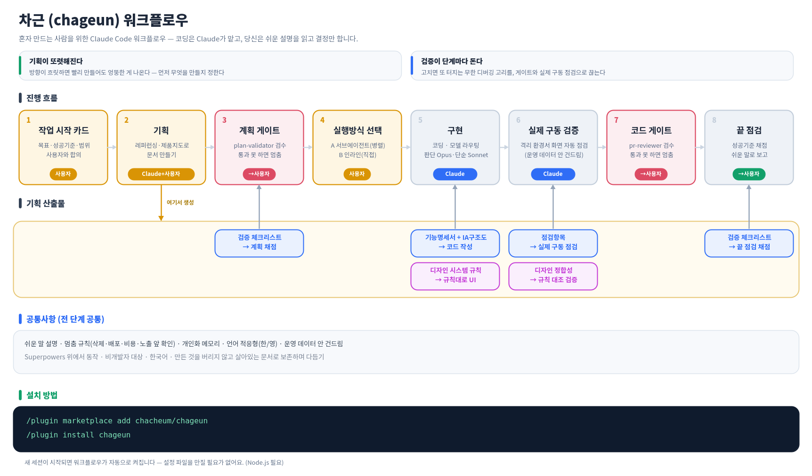

# 차근 (chageun)

*차근차근 — 서두르지 않고 단계별로, 검증하며.*

**혼자 만드는 사람을 위한 Claude Code 워크플로우.**
코딩과 개발 지식은 Claude가 맡습니다. chageun는 옆에서 *방향·검증·일관성*이 무너지지 않게 받쳐줘요 — 당신은 **쉬운 설명을 읽고 결정만** 하면 됩니다.

→ [English](#english) · [한국어](#한국어)



---

## 한국어

### 왜 기획과 검증인가

AI 시대엔 사람의 일이 '만들기'에서 **'검증·판단'으로 옮겨갑니다.** 만드는 건 Claude가 빠르게 해주니, 정작 어려운 건 쏟아진 결과가 맞는지 가려내는 일이죠. 그래서 비개발자의 코딩에서 제일 중요한 건 화려한 기능이 아니라 **기획**과 **검증**입니다.

- **기획이 약하면 — 원하던 것과 다른 게 나옵니다.** 방향이 흐릿하면 Claude가 아무리 빨리 만들어도 엉뚱한 결과가 됩니다. chageun는 레퍼런스 조사·살아있는 기능 명세·화면 구조(IA)로 "뭘 만들지"를 먼저 또렷하게 잡습니다.
- **검증이 약하면 — 빠르게 만든 만큼 빚이 쌓입니다.** 처음엔 빨라 보이지만, 검증 없이 찍어내면 세 가지가 조용히 쌓여요: 1) AI가 만든 게 쌓일수록 다음 작업이 **더 느려지고**, 2) 아무도 제대로 이해 못 한 결과물이 **그대로 굴러가고**, 3) 왜 이렇게 만들었는지 **이유가 휘발돼** 나중에 못 고칩니다. 게다가 A를 고치면 B가 터지는 무한 디버깅까지. chageun는 계획과 코드를 단계마다 적대적으로 검수하고, 코드만 읽는 게 아니라 **격리된 환경에서 화면을 직접 눌러** 확인해 이 고리를 끊습니다.

어려운 말은 필요 없습니다. **코드는 Claude가, 당신은 결정만.** 코드를 못 읽어도 안전장치와 쉬운 설명이 받쳐줍니다.

### 무엇을 해주나

chageun는 **기획 → 게이트 → 구현 → 검증 → 마무리** 흐름 전체를 직접 받칩니다(위 그림).

- **기획** — 레퍼런스 조사, 기능 명세 + 화면 구조(IA)를 살아있는 문서로
- **게이트** — 독립된 심판이 계획·코드를 적대적으로 검수, 통과 못 하면 멈춤
- **구현** — Claude가 코딩 (판단은 똑똑한 모델, 기계적 작업은 빠른 모델로 분담)
- **검증** — 격리 Docker에서 화면을 직접 눌러보는 실제 구동 검증. **운영 데이터는 절대 안 건드림**
- **마무리** — 합의한 성공 기준으로 채점하는 끝 점검
- **항상** — 모든 결과를 쉬운 말로 설명, 위험한 일(삭제·배포·비용·노출) 앞에선 멈춰 확인, 당신의 도메인을 학습

그 위에 **정기 자동 점검 · 보안 스캔 · 디자인 검증**까지 운영 단계도 돕습니다.

<details>
<summary>전체 기능 한눈에</summary>

작업 시작 카드 · 레퍼런싱 · 제품 지도(명세+IA) · 지도 드리프트 점검 · 계획 검증 게이트 · 모델·실행 라우팅 · 실제 구동 검증 · 디자인 정합성 · 코드 검증 게이트 · 끝 점검 · 정성 채점(끝 점검 별점) · 비전문가 요약 · 멈춤 규칙 · 개인화 메모리 · 언어 적응형 · 약속-미실행 가드 · 최소 구현 우선 · 검수·git 안전 · 검증 체크리스트 등뼈 · 정기 자동 점검 · 보안 스캔 · 디자인 검증 사슬
</details>

> **핵심 관점.** chageun는 있는 걸 버리고 스펙에서 재생성하지 않습니다. 당신이 만든 것을 진짜 자산으로 보고, 살아있는 지도와 지속 검증으로 다듬어요. 실제 손님·데이터가 살아있는 일은 원래 이렇게 다뤄야 하고, 그래서 실제 앱을 운영하는 비개발자에게 맞습니다.

### 준비물

- **Node.js** (필수) — Claude Code와 chageun 둘 다 사용. `node -v`로 확인.
- **Docker Desktop** *(또는 로컬 Supabase)* — 백엔드/DB가 있는 앱을 실제 구동 검증할 때만 권장. 격리 환경이라 운영 데이터를 건드리지 않습니다. 정적·DB 없는 앱은 필요 없습니다. [Docker Desktop](https://www.docker.com/products/docker-desktop/)은 직접 설치하세요.

### 설치

```
/plugin marketplace add chacheum/chageun
/plugin install chageun
```

새 세션이 시작되면 워크플로우가 자동으로 켜집니다(설정 파일 편집 불필요). 활성 안내가 안 보이면 아래 "문제 해결"을 보세요.

> **자동 업데이트(선택).** 서드파티 마켓은 기본이 수동 업데이트라, 새 버전은 `/plugin marketplace update chageun`(그다음 `/reload-plugins`)로 받습니다. 공식 플러그인처럼 자동으로 받으려면 직접 켜세요: `/plugin` → Marketplaces → chageun → **Enable auto-update**. 기본 OFF는 의도된 것입니다(서드파티 플러그인이 동의 없이 업데이트를 몰래 밀어 넣지 못하게). chageun는 아직 빠르게 바뀌므로 수동 업데이트가 더 안전한 기본값이에요.

### 함께 설치되는 것 (중요)

이 플러그인은 `claude-plugins-official` 마켓플레이스의 **Superpowers** 방법론 스킬 가운데 **계획 실행·테스트 먼저(TDD)** 등을 사용합니다. **기획 대화·계획서 쓰기·디버깅은 chageun가 직접 갖습니다**(그 세 자리는 이제 Superpowers를 안 씁니다). 남는 자리 때문에 의존성은 그대로 둡니다.

- Superpowers는 **의존성으로 자동 설치**됩니다(따로 설치하지 않아도 됩니다).
- 자동 설치는 **최신 Claude Code(권장 v2.1.143+)**에서 안정적입니다.
- 자동 설치가 안 됐으면 수동으로(이 순서 그대로):
  ```
  /plugin marketplace add claude-plugins-official
  /plugin install superpowers
  ```
  chageun의 의존성과 **같은 출처**에서 설치해야 버전이 어긋나지 않습니다.

### 안 쓰는 개발 서버를 정리합니다 (Linux · WSL)

세션이 **시작될 때** 한 번, 방치된 개발 서버(`next dev` · `vite` 등)에 종료 신호를 보냅니다. 메모리를 크게 잡아먹기 때문입니다. 끄는 조건은 둘 중 하나입니다.

1. 그 서버의 작업 폴더가 **지워졌다**
2. **셋 다** 참이다 — 붙어 있는 접속이 없다 · 그 폴더를 열고 있는 Claude 세션이 없다 · **켜진 지** 2시간이 넘었다

**끄고 싶으면 `CHAGEUN_SKIP_REAP=1` 로 세션을 시작하십시오.** 아무것도 건드리지 않습니다. 더 보수적으로만 하고 싶으면 `CHAGEUN_REAP_MIN_AGE_MS` 로 시간 문턱을 **올리세요**(예: 6시간 = `21600000`). 특정 폴더 아래만 정리하려면 `CHAGEUN_REAP_ONLY_UNDER=/home/나/projects` 처럼 폴더를 지정하세요 — 그 아래 것만 봅니다. **`~` 없는 전체 경로로 적으십시오** — 경로가 안 맞으면 아무것도 정리하지 않습니다(조용히 꺼집니다).

> ⚠ **터미널에서 직접 켠 개발 서버는 "주인 없음"으로 봅니다.** Claude가 켠 것만 주인이 있다고 판단하기 때문입니다. 또 "접속 없음"은 그 순간의 사진이라, 노트북이 절전에서 깨어나 연결만 끊긴 서버(브라우저 탭은 그대로 열려 있음)도 방치로 읽힐 수 있습니다. 끄기 전에 2초 뒤 한 번 더 확인하지만, 그동안 다시 붙지 않으면 종료됩니다. 개발 서버를 손으로 띄워 두고 오래 쓰신다면 위 스위치를 켜 두십시오.

### 작업 상황판 (status.md)

자리를 비운 사이 무슨 일이 있었는지 프로젝트마다 파일 한 장에 모읍니다. 지금 하실 것 · 뒤에서 도는 것 · 정한 것 · 끝난 것이 한 화면에 있습니다.

- 파일 이름은 언어와 상관없이 **`status.md`** 하나입니다.
- **파일이 원본이라 서버 없이도 됩니다.** 그냥 열어 읽으면 됩니다.
- **기본은 이 컴퓨터에서만 보이고 git 에도 안 올라갑니다** — 처음 만들 때 `.git/info/exclude` 에 한 줄을 넣습니다(평문 업무 보고라 커밋 이력에 남으면 지워도 흔적이 남습니다).
- 뒤에서 도는 일감 칸은 **기계가 씁니다**(이름·상태·시각만). 판단이 필요한 칸은 그대로 사람이 씁니다.
- 밖에서 열고 싶으면 사용자가 직접 여십시오. 차근이 대신 열지 않고, 방법만 안내합니다.

### 문제 해결

- **개발 서버가 자꾸 꺼진다:** 위 "안 쓰는 개발 서버를 정리합니다"를 보세요. `CHAGEUN_SKIP_REAP=1` 로 끕니다.
- **활성 안내가 안 보인다 / 게이트·스킬이 안 돈다:** 워크플로우가 안 켜진 것입니다. 1) Superpowers 설치 확인(위 수동 설치) 2) 이 플러그인은 `node`를 쓰므로 `node -v` 확인 3) 이미 열린 세션은 `/reload-plugins` 하거나 새 세션을 엽니다.

---

## English

### Why planning and verification

In the AI era, a person's job shifts from *making* to **verifying and deciding** — Claude produces fast, so the hard part becomes telling whether what poured out is actually right. For people building alone, the two things that matter most aren't features — they're **planning** and **verification**.

- **Weak planning → you get something other than what you wanted.** When the direction is fuzzy, Claude builds fast but builds the wrong thing. chageun pins down *what to build* first — reference research, a living feature spec, a screen map (IA).
- **Weak verification → speed quietly turns into debt.** It looks fast at first, but churning out code without checking piles up three things: 1) the more AI-made code accumulates, the **slower** the next change gets; 2) work **nobody actually understands** ships anyway; 3) the **reasons behind decisions evaporate**, so later you can't fix them — plus the infinite loop where fixing A breaks B. chageun reviews plans and code adversarially at every step, and actually **clicks through your real screens in an isolated environment** to break that loop.

No jargon required. **Claude handles the code; you read plain-language explanations and just decide.**

### What it does

chageun steadies the whole flow itself — **plan → gate → build → verify → wrap** (see the diagram above).

- **Plan** — reference research, a living feature spec + screen map (IA)
- **Gate** — an independent judge reviews plan & code adversarially; blocks until it passes
- **Build** — Claude codes (judgment on a strong model, mechanical work on a fast one)
- **Verify** — clicks real screens in an isolated Docker env; **production writes are hard-blocked**
- **Wrap** — a final check against the success criteria you agreed on
- **Always-on** — plain-language summaries, stop-and-confirm before risky actions (delete·deploy·cost·exposure), learns your domain

Plus **scheduled monitoring · security scans · design verification** for the operating stage.

> **Core stance.** chageun doesn't throw work away and regenerate it from a spec — it treats what you've built as the real asset and refines it with a living map and continuous verification. That's how real, path-dependent work (with live users and data) has to be managed — which is why it fits non-developers shipping real apps.

### Requirements

- **Node.js** (required) — used by both Claude Code and chageun. Check with `node -v`.
- **Docker Desktop** *(or local Supabase)* — only if you want the real run-through on an app with a backend/database. It runs in an isolated environment, so it never touches production data. Static / DB-less apps don't need it.

### Install

```
/plugin marketplace add chacheum/chageun
/plugin install chageun
```

The workflow turns on automatically when a new session starts — no config files to edit. Superpowers is auto-installed as a dependency (works reliably on recent Claude Code, v2.1.143+). If you don't see an activation notice, install Superpowers manually from the same `claude-plugins-official` source, check `node -v`, and run `/reload-plugins`.

> Language-adaptive: the workflow replies in the language you use (defaults to Korean). The source content is Korean; Claude reads it and answers you in your language.

### Status board (status.md)

One plain file per project holds what happened while you were away: what needs you, what is running in the background, what was decided, what is done.

- The file is always named **`status.md`**, whatever language you work in.
- **The file is the source of truth — no server needed.** Just open it.
- **By default it stays on your machine and out of git** — one line goes into `.git/info/exclude` when it is created (it is a plain-language work report; once committed, deleting it later still leaves it in history).
- The "running in the background" section is **written by the machine** (name, state, time only). Sections that need judgment stay yours.
- To reach it from outside your machine, do that yourself. chageun explains how; it does not open anything for you.

---

## 구성 / Components

- `rules/operating-rules.md` — 워크플로우 본체(세션 시작 시 자동 적용)
- `skills/` — referencing(레퍼런스) · product-map(명세+IA) · design-system(디자인 규칙) · monitoring(정기 점검) · security-scan(보안 스캔)
- `agents/` — plan-validator(계획 게이트) · pr-reviewer(코드 게이트) · code-implementer(기계적 구현) · deep-implementer(판단 걸린 구현) · supervisor(여러 바퀴 지휘)
- `hooks/finish-work.js` — 약속-미실행 차단 훅(Stop hook)

## 라이선스 / License

MIT
